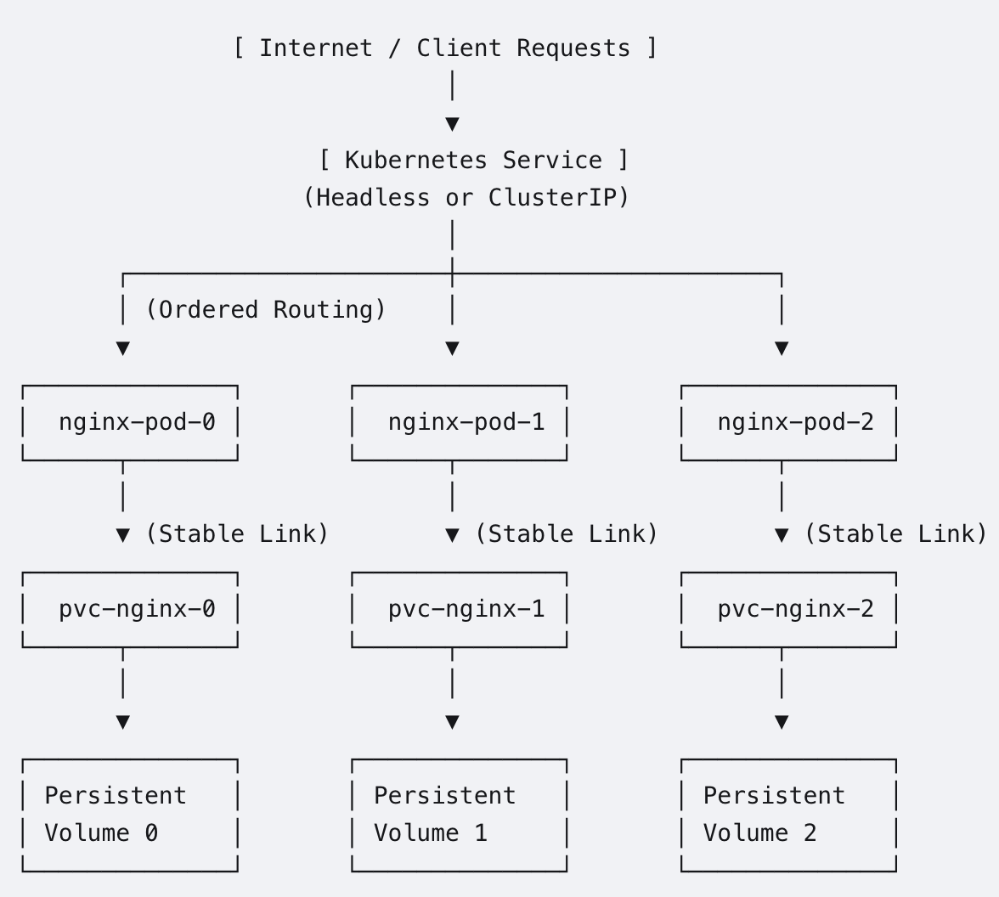
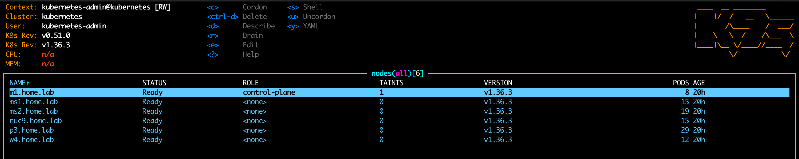
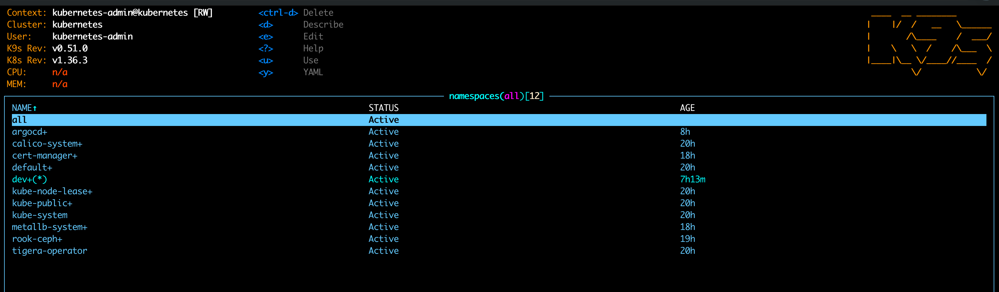
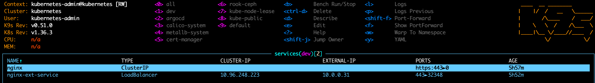
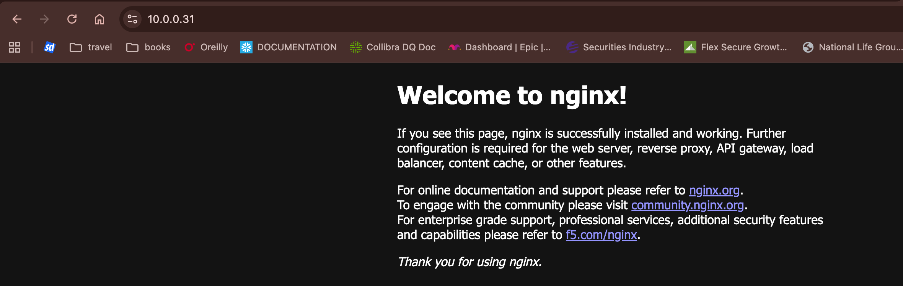
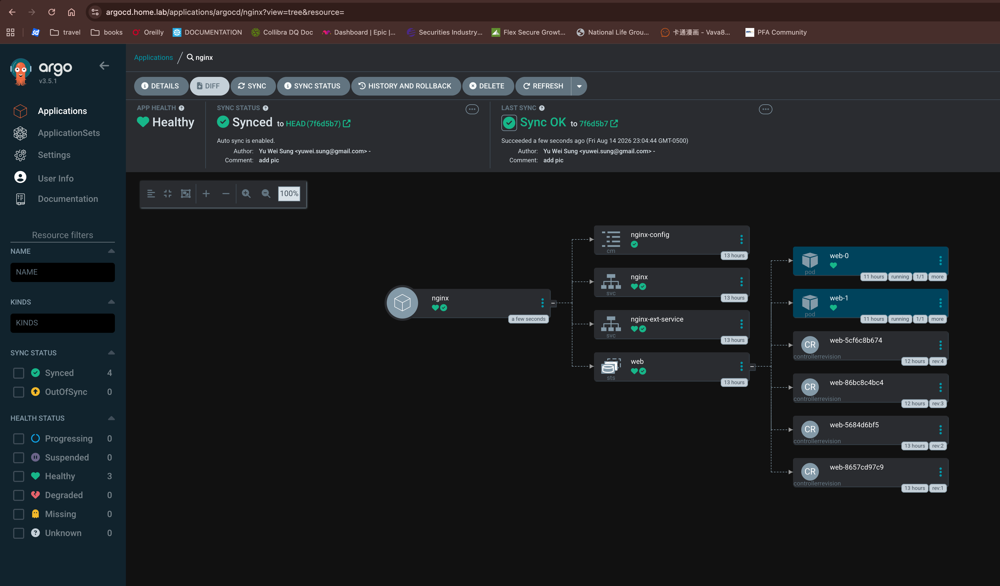

# Nginx Practices
## Design
An NGINX StatefulSet in Kubernetes manages stateful workloads, ensuring pod identity, persistent storage, and ordered deployments. Here is the design diagram and its core architectural breakdown.



### Core Architectural Features
* Stable Network Identity: Each Pod gets a sticky, predictable hostname formatted as $(statefulset-name)-$(ordinal). For example: nginx-0, nginx-1, and nginx-2.
* Dedicated Storage (VolumeClaimTemplates): Unlike Deployments where pods share storage or claim volumes randomly, a StatefulSet assigns a unique PersistentVolumeClaim (PVC) to each Pod index. If nginx-0 restarts, it will reconnect exactly to pvc-nginx-0.
* Ordered Deployment: Pods are created sequentially from 0 to N-1. The next pod will not start until the previous pod is completely healthy and running.

### Primary Use Cases for NGINX StatefulSet
While NGINX is usually deployed as a stateless application, there are specific, high-utility use cases that require a StatefulSet.

1. Content Delivery Network (CDN) & Edge Caching
   
The Problem: If you deploy NGINX as a stateless Deployment, cached assets are distributed randomly. A pod restart loses the local cache entirely.The StatefulSet Solution: Each NGINX pod acts as a dedicated cache node. Because storage persists across pod restarts, cached data (like heavy media files, images, or static assets) survives crashes. This avoids hitting backends for cache misses.

3. Stateful Reverse Proxy with Persistent Logs

The Problem: High-compliance environments require audit logs and access logs to never be dropped or interrupted during a deployment rollout.The StatefulSet Solution: NGINX access/error logs write directly to isolated persistent storage attached to that specific node, facilitating reliable log shipping (via agents like FluentBit or Logstash) without data loss during restarts.

4. Distinct NGINX Upstream Sharding

The Problem: You need a fixed pool of proxy servers where external firewalls or internal services require predictable, static network endpoints.The StatefulSet Solution: Pairing NGINX with a Headless Service generates direct DNS A-records for each pod (e.g., nginx-0.nginx-service.default.svc.cluster.local). This allows upstream systems to target a specific NGINX instance deterministically.

## Implementation

    The practice contains two parts, one is k8s (kubeadm) deployment to my home lab, and the other is nginx statefulset deployment. 

### 1. K8s with kubeadm

* Installing ansible

    "ansible" is required in this repo to wrap kubeadm init/join commands. Refer to ansible site to install ansible to your local desktop.

    ```
    brew install ansible
    ```

* Modifying the hosts file (inventory)

    Modify the hosts file to reflect your inventory.  I have 1 master and 4 workers (ubuntu servers) and have ssh-copy-id sending my ssh public key to those servers. 

    ```
    cd infra
    mv hosts.template hosts
    ```

* Deploying k8s cluster

    First, as k8s requirements, setup some kernel configs in each server.  The action includes:
    1) containerd
    2) k8s kernel modules
    3) sysctl
    4) k8s gpg keys

    ```
    cd infra
    ansible-playbook os/main.yaml
    ```

    Second, run kubeadm/main.yaml to deploy k8s control/data planes. The kubeadm.yaml will be used in kubeadm init process.The kubeadm/main.yaml includes actions: 
    1) copy the kubeadm.config to master host
    2) run kubeadm init with the config file
    3) copy the admin.conf to local once the control-plane is init
    4) run kubeadm join command on all worker nodes
    5) apply some kube-bench harden works

    ```
    cd infra
    ansible-playbook kubeadm/main.yaml
    ```

    Once the actions finished, you can use kubectl to check the status because one of the task pulled the admin.conf to ~/.kube/config directly. 
    Next step, we deploy the callico cni. You should see that nodes are READY after calico installed. The last action in the playbook is a for loop to approve kubelet csr. Check csr status before you move to next step. Refer to calico doc for calico operator installation detail.

    
    ```
    cd infra
    ansible-playbook kubectl/0_callico.yaml
    ```


    

    Continue installing metallb, rook-ceph and cert-manager by running following playbooks. Note that you will need a keypair (self-signed) to create a ca-issuer.  Google openssl self-sign for commands.

    ```
    cd infra
    ansible-playbook kubectl/2_metallb.yaml
    ansible-playbook kubectl/3_rook-ceph.yaml
    ansible-playbook kubectl/4_cert-manager.yaml
    ```
    
    After the deployment, you should see namespaces

    

### 2. Nginx statefulset with TLS

* Creating private key and csr

    ```
    openssl genrsa -out user1.key 2048
    openssl req -new -key user1.key -out user1.csr -subj "/CN=user1/O=dev"
    ```

* Creating user csr manifest

    ```
    cat << EOF > user1-csr.yaml
    apiVersion: certificates.k8s.io/v1
    kind: CertificateSigningRequest
    metadata:
      name: user1-csr
    spec:
      request: `cat user1.csr|base64|tr -d "\n"`
      signerName: kubernetes.io/kube-apiserver-client
      expirationSeconds: 864000
      usages:
        - client auth
    EOF
    ```

* Applying and Approving user csr to k8s

    ```
    kubectl apply -f user1-csr.yaml
    kubectl get csr
    kubectl certificate approve user1-csr
    kubectl get csr user1-csr -o jsonpath='{.status.certificate}' | base64 -d > user1.crt
    ```

* Checking the user certificate

    ```
    openssl x509 -in user1.crt -noout -text
    ```

* Creating dev namespace

    ```
    kubectl create ns dev
    ```

* Applying user1/argocd rbac

    ```
    cat <<EOF > user1-rbac.yaml
    apiVersion: rbac.authorization.k8s.io/v1
    kind: Role
    metadata:
      name: user1-role
      namespace: dev
    rules:
    - apiGroups: ["apps",""]
        resources: ["statefulsets","deployments", "pods", "services", "persistentvolumeclaims"]
        verbs: ["get", "list", "watch", "create", "update", "patch", "delete"]
    ---
    apiVersion: rbac.authorization.k8s.io/v1
    kind: RoleBinding
    metadata:
      name: user1-binding
      namespace: dev
    subjects:
    - kind: User
      name: user1
      namespace: dev
    - kind: ServiceAccount
      name: argocd-application-controler
      namespace: argocd
    roleRef:
      kind: Role
      name: user1-role
      apiGroup: rbac.authorization.k8s.io
    EOF

    kubectl apply -f user1-rbac.yaml
    ```

* Setting user1 context

    ```
    kubectl config set-credentials user1 --client-certificate=user1.crt --client-key=user1.key --embed-certs=true
    kubectl config set-context user1-context --cluster=kubernetes --user=user1
    kubectl config use-context user1-context
    ```


* Prepparing nginx config

    ```
    cat <<EOF >nginx-cm.yaml
    apiVersion: v1
    kind: ConfigMap
    metadata:
      name: nginx-config
      namespace: dev
    data:
      default.conf: |
        server {
        listen      443 ssl http2;
        ssl_certificate /etc/nginx/tls/tls.crt;
        ssl_certificate_key /etc/nginx/tls/tls.key;
        ssl_protocols	TLSv1.3;

        location / {
            root   /usr/share/nginx/html;
            index  index.html index.htm;
        }

        error_page   500 502 503 504  /50x.html;
        location = /50x.html {
            root   /usr/share/nginx/html;
        }
      }
    EOF
    ```

* Preparing nginx statefulset

    ```
    cat <<EOF >nginx-sts.yaml
    ---
    apiVersion: v1
    kind: Service
    metadata:
      name: nginx
      namespace: dev
      labels:
        app: nginx
    spec:
      ports:
      - port: 443
        name: https
      clusterIP: None
      selector:
        app: nginx
    ---
    apiVersion: apps/v1
    kind: StatefulSet
    metadata:
      name: web
      namespace: dev
    spec:
      serviceName: nginx
      replicas: 2
      selector:
        matchLabels:
        app: nginx
      template:
        metadata:
          labels:
            app: nginx
        spec:
          containers:
          - name: nginx
            image: nginx:latest
            ports:
            - containerPort: 443
              name: https
            volumeMounts:
            - name: nginx-config
              mountPath: /etc/nginx/conf.d/default.conf
              subPath: default.conf
            - name: tls
              mountPath: /etc/nginx/tls
              readOnly: true
        volumes:
        - name: nginx-config
          configMap:
            name: nginx-config
        - name: tls
          csi:
            driver: csi.cert-manager.io
            readOnly: true
            volumeAttributes:
                csi.cert-manager.io/issuer-name: ca-issuer
                csi.cert-manager.io/issuer-kind: ClusterIssuer
                csi.cert-manager.io/dns-names: ${POD_NAME}.${POD_NAMESPACE}.svc.cluster.local,www.home.lab
                csi.cert-manager.io/ip-sans: 10.0.0.31
                csi.cert-manager.io/common-name: "${SERVICE_ACCOUNT_NAME}.${POD_NAMESPACE}"
    EOF
    ```

* Preparing nginx loadbalancer service

    ```
    cat <<EOF >nginx-ext-svc.yaml
    apiVersion: v1
    kind: Service
    metadata:
      name: nginx-ext-service
      namespace: dev
    spec:
      selector:
        app: nginx
      ports:
      - protocol: TCP
        port: 443
        targetPort: 443
      type: LoadBalancer
      sessionAffinity: ClientIP
      sessionAffinityConfig:
        clientIP:
          timeoutSeconds: 10800
    EOF
    ```

* Testing manifests with kubectl user1 context
    
    Before pushing the artifacts to github, deploy them using kubectl.
    ```
    kubectl config use-context user1-context
    kubectl apply -f nginx-cm.yaml
    kubectl apply -f nginx-sts.yaml
    kubectl apply -f nginx-ext-svc.yaml
    ```
    
    You should see two services, one is headless and the other is external.

    

    From the web browser
    

    (OPTIONAL) Now we can remove those artifacts and use Argocd to deploy the app from github.

    ```
    kubectl delete -f nginx-ext-svc.yaml
    kubectl delete -f nginx-sts.yaml
    kubectl delete -f nginx-cm.yaml
    ```

### Argocd (Devops)

* Installing argocd

    Run the default argocd manifest to install argocd in the same k8s cluster.

    ```
    kubectl create ns argocd
    kubectl apply -n argocd --server-side --force-conflicts -f https://raw.githubusercontent.com/argoproj/argo-cd/stable/manifests/install.yaml
    ```

* Setting TLS for Argocd server 

    Argocd detect tls secret, argocd-server-tls, and auto mount the tls. Deploy the tls certificate in the "argocd" namespace will turn on TLS.

    ```
    kubectl apply -f infra/argocd/argocd-tls.yaml
    ```
    
    You can find the argocd admin init password as secret in argocd namespace. Decode the secret and login the web ui as "admin".

* Creating an application in argocd
    
    Let's create the first argocd application using argocd cli.

    ```
    argocd login argocd.home.lab
    argocd app create nginx --repo https://github.com/yuweisung/nginx.git --path www --dest-namespace dev --dest-server https://kubernetes.default.svc
    ```

* Creating a github project
    Login to github and create a project call 'nginx' and push the content to github. Argocd will chech the www folder and apply the manifests to k8s cluster dev namespace.

    Once the content is on github repo, open the web browser and login to argocd with admin/password.

    

* Adding feattures to the nginx statefulset

    TBC

* Adding Harbor repo and customize nginx image

    TBC

## 3. Reset the k8s cluster
To destroy the cluster, you can use the reset playbook. It will remove cni, rook and lvm labels.

```
ansible-playbook kubeadm/reset.yaml
```
  
## 4. Troubleshooting
